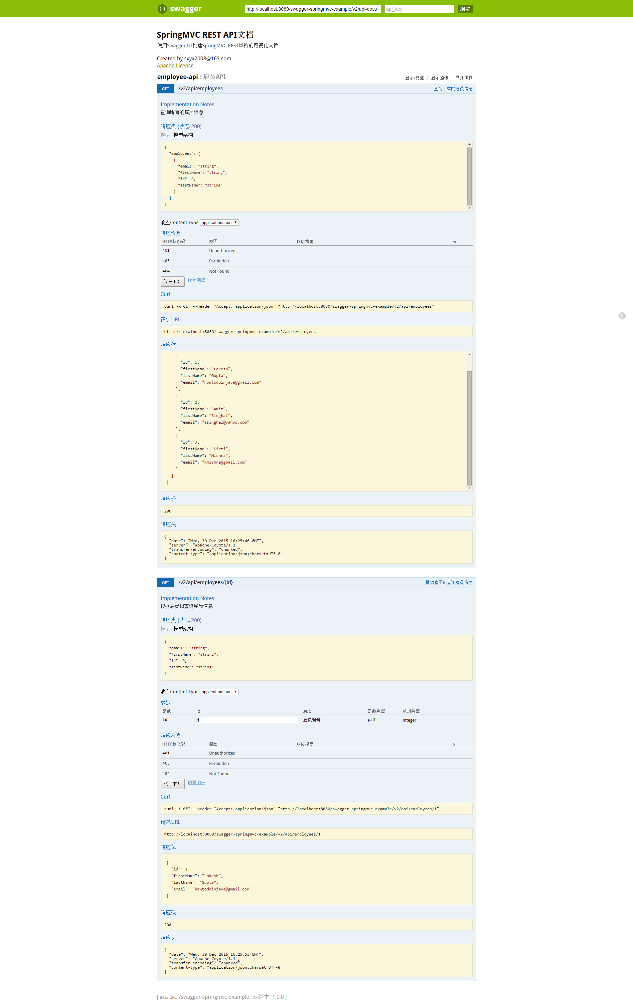

# swagger-springmvc-example

使用swagger 2构建springmvc rest服务API自动化文档

# swagger api 描述信息

http://localhost:8080/swagger-springmvc-example/v2/api-docs

# swagger ui api自动化文档访问地址

http://localhost:8080/swagger-springmvc-example/index.html

# 演示

# 相关资源

https://github.com/swagger-api/swagger-ui

https://github.com/springfox/springfox